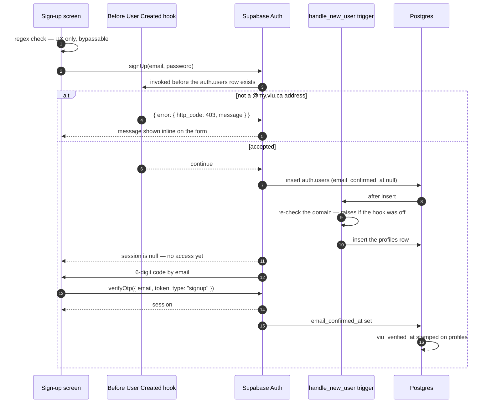

# Authentication — the VIU gate

How someone becomes a Rabbithole user, and what stops someone who is not a VIU
student. Companion to [`roadmap.md`](roadmap.md) and [`schema.md`](schema.md).

**The domain is `@my.viu.ca`** — a subdomain, with a dot. `@viu.ca` is VIU's
employee domain. See the correction section of `roadmap.md`; three files in this
repo had it wrong.

---

## The flow



---

## Three layers, and why each exists

### Layer 1 — the client regex

A check in the sign-up form so someone typing a Gmail address finds out
immediately rather than after a round trip.

```ts
const VIU_EMAIL = /@my\.viu\.ca$/i;
```

**This is UX and nothing else.** Anyone can `curl` the Auth REST endpoint directly
and skip the app entirely. Treat it as a keyboard convenience, never as the gate.

### Layer 2 — the Before User Created hook

**This is the actual gate.** It runs inside GoTrue *before* the `auth.users` row is
created, on every signup path — the app, the REST API, `curl`, anything.

There is **no native "allowed email domains" setting in Supabase.** It has been an
open feature request since 2023. This hook is the only authoritative mechanism, and
it is available on the Free and Pro plans.

Implemented as a Postgres function, `security definer set search_path = ''`:

```sql
create or replace function public.before_user_created_viu_gate(event jsonb)
returns jsonb
language plpgsql
security definer
set search_path = ''
as $$
declare
  claimed_email text := lower(event -> 'user' ->> 'email');
begin
  if claimed_email is null or claimed_email !~ '@my\.viu\.ca$' then
    return jsonb_build_object('error', jsonb_build_object(
      'http_code', 403,
      'message', 'Rabbithole is for VIU students. Please use your @my.viu.ca address.'
    ));
  end if;

  return '{}'::jsonb;   -- empty object means "continue"
end;
$$;

grant execute on function public.before_user_created_viu_gate to supabase_auth_admin;
revoke execute on function public.before_user_created_viu_gate from authenticated, anon, public;
```

The `message` surfaces directly as the client's `signUp()` error, so **that string
is user-facing copy**. Write it as copy, not as a log line.

The hook checks exactly one thing: the email domain. That is the whole gate.

### Layer 3 — the trigger that re-checks

`handle_new_user` raises if the email does not end `@my.viu.ca`. Full source in
[`schema.md`](schema.md#handle_new_user--the-third-layer-of-the-viu-gate).

**Why a third check at all:** the hook is *dashboard configuration*, not code in
this repository. It can be disabled, misconfigured, or lost in a project restore
without a commit, and nothing in CI would notice. The trigger lives in a migration,
so the check is version controlled and travels with `supabase db reset`. This is
insurance against the one failure mode that would otherwise be completely silent —
the gate quietly being off while signups keep succeeding.

---

## No student number

Dropped 2026-09-18. A verified `@my.viu.ca` address already proves VIU membership,
which was the only job the number had.

It also could not have done that job. Supabase's own documentation: *"Never trust
`raw_user_meta_data` for authorization — this information can be modified by
authenticated end users."* A number passed through `signUp({ options: { data } })`
lands in exactly that field. Nothing available here can check it against VIU's
records, so it would have been a self-asserted claim sitting next to a verified one
— with its own table, its own RLS posture, and a standing rule that no screen may
ever render it as verified.

**`display_name` is the one thing still read from user metadata**, and that is fine
precisely because nothing is authorised on it. It is cosmetic, and it falls back to
the email local part — which for VIU is already `Preferred.Lastname`.

---

## Email verification

Password plus a **6-digit OTP code**, not a confirmation link. Supabase's docs
favour the code on mobile precisely because links depend on deep-linking back into
the app, which is fragile across mail clients and needs per-platform configuration.

Before verification, `signUp()` returns a user with no session. The app has an
account that cannot do anything — which is correct, and the `/verify` route is the
only place it can go.

```ts
// sign-up
const { error } = await supabase.auth.signUp({
  email,
  password,
  options: { data: { display_name: name } },
});

// verify
const { data, error } = await supabase.auth.verifyOtp({
  email,
  token,            // the 6 digits
  type: "signup",
});
```

On success, `email_confirmed_at` is set on `auth.users`, the
`handle_email_confirmed` trigger stamps `profiles.viu_verified_at`, and the session
arrives.

### The SMTP limit is a real blocker

Supabase's built-in email service is capped at **2 emails per hour**, best-effort.
One OTP attempt is one email. Two people testing signup together will hit it inside
a minute, and the failure looks like "our app is broken" rather than "we hit a quota".

**Custom SMTP is a prerequisite, not a scaling concern.** Resend, Postmark, and
SendGrid all have free tiers sufficient for a campus-sized app.

The resend button on `/verify` needs a cooldown that respects this — a user tapping
it four times burns two hours of quota.

---

## Dashboard checklist

These are clicks, not code, which means none of them is in version control and any
of them can silently regress. Re-check this list after any project restore.

- [ ] **Auth → Providers → Email** — enabled, "Confirm email" **on**
- [ ] **Auth → Email Templates → Confirm signup** — uses `{{ .Token }}` (the 6-digit
      code), not `{{ .ConfirmationURL }}`. Paste the body of
      `supabase/templates/confirmation.html`, which is already version-controlled
      and wired into local dev via `[auth.email.template.confirmation]`. Skip this
      and the email sends a link, leaving `verifyOtp` with no code to accept —
      verified locally on 2026-09-18, where the default template produced zero
      6-digit codes.
- [ ] **Auth → SMTP Settings** — custom provider configured, sender verified
- [ ] **Auth → Hooks → Before User Created** — enabled, pointed at
      `public.before_user_created_viu_gate`
- [ ] **Auth → URL Configuration** — `rabbithole://` in the redirect allow-list
      (unused by the OTP flow, but needed if password reset is added later)
- [ ] **Database → Replication** — `messages` added to `supabase_realtime`, only
      when the Messages tab goes live

---

## Proving the gate works

A passing signup proves nothing — the client regex would have blocked a bad address
before it left the device. **Test from outside the app.**

```bash
curl -X POST "$SUPABASE_URL/auth/v1/signup" \
  -H "apikey: $SUPABASE_KEY" \
  -H "Content-Type: application/json" \
  -d '{"email":"someone@gmail.com","password":"test12345"}'
```

Expect a **403** carrying the hook's message. A `200` here means the gate is off,
regardless of what the app does.

Then disable the hook in the dashboard and repeat the same request. The signup
should **still** fail — this time from the trigger, with a `500` rather than a clean
`403`. That is how you confirm Layer 3 is real rather than decorative. Re-enable the
hook afterwards.

---

## Session handling in the app

`Stack.Protected` with a `guard` on session state is the current Expo Router
pattern:

```tsx
<Stack>
  <Stack.Protected guard={!!session}>
    <Stack.Screen name="(tabs)" />
  </Stack.Protected>
  <Stack.Protected guard={!session}>
    <Stack.Screen name="(auth)" />
  </Stack.Protected>
</Stack>
```

> **Verify during implementation:** only `Stack.Protected` is documented. This
> project's tab bar is `expo-router/js-tabs`, and no `Tabs.Protected` equivalent is
> documented. Likely moot — auth is reached *from* the Profile tab rather than
> gating the bar — but confirm before leaning on it.

Once a session exists, `(auth)/_layout.tsx`'s `handleDismiss` can stop hardcoding
`router.push("/")`. Its own TSDoc says "revisit once there is a session to route
on"; this is that moment.

---

## Open questions

- **Email expiry.** VIU addresses die at graduation. Is `viu_verified_at` re-checked
  on a schedule, or is verification a one-time stamp? Carried from `ARCHITECTURE.md`
  — and it gets worse in v2, where an unreachable seller may have a bank account
  attached.
