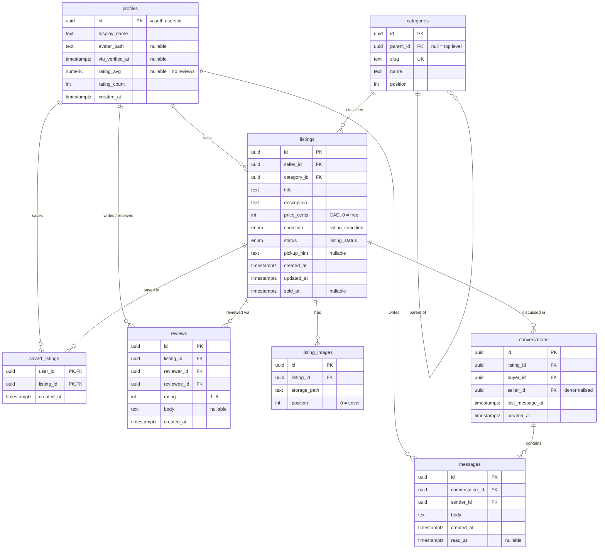

# Rabbithole backend — roadmap

The plan of record for taking Rabbithole from "no backend" to a working Supabase
project with VIU-gated authentication. Every later phase is checked against this
document.

- **Opened:** 2026-09-18
- **Start here to connect the project:** [`setup.md`](setup.md)
- **Companion documents:** [`schema.md`](schema.md) · [`supabase-api-guide.md`](supabase-api-guide.md) · [`auth-flow.md`](auth-flow.md)
- **Design scratchpad:** `ARCHITECTURE.md` at the repo root (gitignored, local only)

## Status

| Phase | What | State |
| --- | --- | --- |
| 0 | Prerequisites — Docker, Supabase project, custom SMTP | 🚧 Docker + project done; **SMTP outstanding** |
| 1 | Design documents and the ER diagram | ✅ 2026-09-18 |
| 2 | Install, `supabase init`, migration workflow | ✅ 2026-09-18 |
| 3 | Schema migrations, RLS, seed | ✅ 2026-09-18 — `db reset` replays clean; RLS proven negative |
| 4 | Authentication — the VIU gate | ✅ locally — gate + OTP round-trip verified. Hosted project still needs dashboard config |
| 5 | Client data layer (`src/lib/`) | 🚧 `supabase.ts`, `session.tsx`, `storage.ts`, `format.ts` done; `queries/` outstanding |
| 6 | Wire the auth screens | ⬜ |

Tick a row here when a phase lands. This table is the answer to "where are we".

---

## Decision log

Settled **2026-09-18**. These are answered, not open. To revisit one, change it
here, in a commit, with a reason — do not re-litigate it from scratch.

| Decision | Chosen | Because |
| --- | --- | --- |
| Email gate | `@my.viu.ca` only | It is VIU's documented *student* domain. `@viu.ca` is employees, and this is a student marketplace. |
| Student number | **Dropped** (reversed 2026-09-18, after being designed) | A verified `@my.viu.ca` address already proves VIU membership. The number could not be verified against VIU's records, so it added PII and a whole second table in exchange for nothing the email did not already do. |
| Verification | Password + 6-digit email OTP | Keeps the existing sign-in/sign-up screens as they are. Confirmation links depend on deep-linking, which is fragile on mobile. |
| First migration | Core 8 tables | Exactly `ARCHITECTURE.md`'s v1 model, matching `src/types`, so generated types diff cleanly. Reporting and blocking wait for someone to own the queue. |
| Enum representation | Native Postgres enums | `supabase gen types` emits a union for an enum and a bare `string` for `text` + CHECK. See *Choices worth defending*. |
| Migration style | Versioned migrations, not declarative schemas | Declarative `db diff` compares against files, not the live database, so Studio changes vanish silently. |

### Still open

- **Does `expo-router/js-tabs` have a `Tabs.Protected`?** Only `Stack.Protected` is
  documented. Probably moot here — auth is reached *from* the Profile tab rather
  than gating the tab bar — but confirm before leaning on it.
- **Email expiry.** VIU addresses die at graduation. Is `viu_verified_at` re-checked
  on a schedule, or a one-time stamp? Carried over from `ARCHITECTURE.md`.
- **Image pipeline.** Resize on device before upload, or an Edge Function on write?
  Unresized phone photos will dominate the Storage free tier.

---

## The correction this roadmap is built on

The original request said `@myviu.ca`. Both auth screens' placeholders said
`you@myviu.ca`. `ARCHITECTURE.md` said the hook rejects non-`@viu.ca` signups.
**All three were wrong**, and any of them would have locked every real student out.
All three are corrected as of 2026-09-18.

VIU's IT knowledge base: student addresses are `PreferredName.LastName@my.viu.ca`
— `my.viu.ca` is a **subdomain, with a dot**. `@viu.ca` is the employee domain. As
of 2026-08-01 the `my.viu.ca` address is the only one VIU uses to contact current
students.

Sources: [How Student Emails at VIU Work](https://ithelp.viu.ca/TDClient/169/ITPortal/KB/ArticleDet?ID=10704) ·
[Signing Into Your VIU Student Computer Account](https://ithelp.viu.ca/TDClient/169/ITPortal/KB/ArticleDet?ID=12057) ·
[Employee resources](https://employees.viu.ca/)

The domain lives in exactly two places — the auth hook and the re-checking trigger
— never as a scattered literal.

---

## Phase 0 — Prerequisites

**Blocked on the project owner. These three gate everything from Phase 2 on.**
Step-by-step instructions, including exactly which values to hand over and which to
withhold, are in [`setup.md`](setup.md).

1. **Start Docker Desktop.** Installed (v29.7.2) but the daemon is down —
   `docker info` fails on the named pipe. `supabase start` runs the whole stack in
   containers and cannot work without it. On Windows the analytics container also
   wants the daemon socket exposed at `tcp://localhost:2375` (Docker Desktop →
   Settings → General).

2. **Create a Supabase project** (free tier is fine); note the project ref, URL, and
   publishable key. Local-only development covers Phases 2–3, but the Auth Hook in
   Phase 4 is dashboard configuration on a hosted project.

3. **Arrange custom SMTP — not optional.** Supabase's built-in email service is
   rate-limited to **2 emails per hour**, best-effort. An OTP signup burns one email
   per attempt, so the default makes even two people testing together impossible.
   Resend, Postmark, or SendGrid free tiers all work (Auth → SMTP Settings). This is
   the kind of limit that reads as "our signup is broken" three days in.

**Ownership.** This work writes to both `supabase/` (backend session territory) and
`src/types/` (UI session territory) per `.claude/rules/workflow.md`. It must run as
a **single session** — do not start a parallel Claude session against this repo
while it is in flight.

---

## Phase 1 — Design documents and the diagram

Four tracked files under `docs/backend/`:

| File | Holds |
| --- | --- |
| `roadmap.md` | This document. The plan of record. |
| `schema.md` | Mermaid ER diagram, per-table columns and constraints, full DDL, the reason for each non-obvious choice. |
| `supabase-api-guide.md` | Client setup, query patterns, and the traps. |
| `auth-flow.md` | Sequence diagram for the VIU gate, plus the dashboard checklist. |

### Corrections made in this phase

Done, 2026-09-18:

- `ARCHITECTURE.md` — the Edge Function line now says `@my.viu.ca`.
- `src/app/(auth)/sign-in.tsx`, `src/app/(auth)/sign-up.tsx` — placeholders now
  read `you@my.viu.ca`.
- `src/types/profile.ts` — the `viu_verified_at` TSDoc now says `@my.viu.ca`.

`npx tsc --noEmit` clean after all four.

Left alone: `docs/vault/Rabbithole.md` is stale (snapshot at commit `195adc1`;
describes 0-byte tab files and a `<Stack/>` in the tabs layout). It is a personal
note, and a staleness marker is cheaper than a rewrite.

---

## The schema

Eight tables — `ARCHITECTURE.md`'s v1 model, transcribed from `src/types`.

Full column definitions and DDL live in [`schema.md`](schema.md).



### Choices worth defending

**Native Postgres enums, not `text` + CHECK.** `ARCHITECTURE.md`'s ER writes
`text "draft|active|..."`. Deviating on purpose: `supabase gen types typescript`
emits a real union for an enum and a bare `string` for a checked text column. The
types README's stated plan is to re-export generated rows and keep view models by
hand — with `text` that plan silently loses `ListingStatus` and `ListingCondition`,
and `theme.colors.listingStatus` (a total `Record<ListingStatus, ColorPair>`) stops
being a compile-time guard. The usual enum objection — hard to alter — does not bite
here, because the v1/v2 compatibility contract explicitly promises **no new enum
members**. Caveat: `ALTER TYPE ... ADD VALUE` cannot be used in the same migration
that then uses the value, so any future addition is a two-migration change.

**`title` capped at 200 characters, not eBay's 80.** The nursing-bundle fixture is
~151 characters and exists specifically to break naive layouts. A tighter cap would
reject a fixture the mocks README forbids tidying. Cards still truncate at two lines
via `numberOfLines`.

**`sold_at` constrained to agree with `status`.** `check (status <> 'sold' or
sold_at is not null)` — sold implies a timestamp. Deliberately one-directional so a
listing that goes `sold → removed` keeps its history.

**`listing_images` uniqueness is deferrable.** `unique (listing_id, position)
deferrable initially deferred`, because reordering photos swaps two positions inside
one transaction and a non-deferrable constraint fails mid-swap.

**Two-level category tree enforced by trigger, not CHECK.** A CHECK constraint
cannot run the subquery that asks "does my parent itself have a parent". The trigger
raises if it does, which is what makes the drill-down picker in `design-rules.md`
safe.

**Reviews require a completed trade.** The INSERT policy demands the listing is
`sold` and the reviewer held a conversation on it. Without that, reviews are
free-form reputation and trivially farmed.

### Deliberate additions to `src/types` (three, all additive)

The types README says every generated-vs-handwritten difference is "either a schema
mistake or a UI assumption that was never true". These are neither — they are
intentional, and they get written into `src/types` in the same change so nothing
drifts silently:

| Addition | Why |
| --- | --- |
| `Category.position: number` | The Discover category bar needs a deliberate order; alphabetical-by-accident puts Course Supplies first. |
| `Listing.updated_at: string` | Edits are real. "Posted 3d ago" on a listing edited an hour ago is a lie. |
| New `SavedListing` interface | `saved_listings` is in `ARCHITECTURE.md` and has no hand-written type at all — a genuine pre-existing gap. |

### Storage path convention change

The standard Supabase Storage RLS pattern matches `(storage.foldername(name))[1]`
against the user's id, so object paths must **start** with the owner's uuid:

```
listing-images/{user_id}/{listing_id}/{position}.jpg
avatars/{user_id}/avatar.jpg
```

`src/mocks/listings.ts` currently generates `listings/{listingId}/{position}.jpg`,
with no user segment. That fixture is wrong about the schema rather than awkward on
purpose, so it gets updated — this is not the "don't tidy fixtures" rule, which
covers fixtures that surface layout bugs.

---

## Phase 2 — Install, init, and the migration workflow

```bash
npx expo install @supabase/supabase-js expo-sqlite
npx supabase init
npx supabase start          # needs Docker running — see Phase 0
```

**Versioned migrations (`supabase migration new`), not declarative schemas.**
Supabase's declarative-schema docs stop short of calling it production-ready and
list real gaps: DML is not captured, RLS-policy and view-ownership tracking is
incomplete, and `db diff` compares against the `supabase/schemas/` files rather than
the live database — so any change made in Studio is silently dropped on the next
diff. Hand-written versioned migrations have none of those gaps.

Secrets: `.env` with `EXPO_PUBLIC_SUPABASE_URL` / `EXPO_PUBLIC_SUPABASE_KEY`, read
via `process.env`. **The app `.gitignore` currently ignores only `.env*.local`**, so
a plain `.env` would be committed — add `.env` to it in this phase. The
`service_role` key never enters the client, per the compatibility contract.

---

## Phase 3 — Schema migrations

One migration per concern, so a failure is legible:

| Migration | Contains |
| --- | --- |
| `..._enums_and_tables.sql` | `listing_condition`, `listing_status`, the eight tables, all constraints |
| `..._indexes.sql` | Feed, inbox, and search indexes |
| `..._triggers.sql` | The seven triggers |
| `..._rls.sql` | `enable row level security` on all eight + every policy |
| `..._views.sql` | `listing_summaries` with `security_invoker = on` |
| `..._storage.sql` | `listing-images` and `avatars` buckets + object policies |

**Indexes:** `listings(status, created_at desc)` for the feed, `listings(seller_id)`,
`listings(category_id)`, `listing_images(listing_id, position)`,
`conversations(buyer_id, last_message_at desc)` and the `seller_id` twin,
`messages(conversation_id, created_at)`, `reviews(reviewee_id)`,
`saved_listings(user_id, created_at desc)`, plus a GIN index on a
`title || description` tsvector — `design-rules.md` makes search first-class.

**Triggers:** `handle_new_user` (Phase 4), `set_viu_verified_at` on email
confirmation, `refresh_profile_rating` on review write, `touch_conversation` on
message insert, `touch_listing_updated_at`, `enforce_category_depth`, `set_sold_at`.

**RLS posture.** Every table gets `enable row level security` and policies scoped
`to authenticated` with `(select auth.uid())` wrapping — the select wrapper lets
Postgres cache it as an initPlan instead of re-evaluating per row, and is still
current guidance. `profiles` is readable by all authenticated users because every
feed card joins a seller preview; `listings` exposes `draft` and `removed` only to
their owner; `categories` is read-only to clients, since it is seeded and
administered rather than user-generated.

**Seed.** `supabase/seed.sql` transcribed from `src/mocks` — the same twelve
listings, five profiles, ten categories, and four conversations, with their awkward
cases intact. The free item, the photoless listing, the null pickup hint, and the
`rating_avg: null` seller are precisely the rows that prove the schema tolerates
what the UI already handles.

---

## Phase 4 — Authentication: the VIU gate

Three layers. The middle one is the only one that is authoritative; the other two
exist because each fails differently. Detail and the dashboard checklist live in
[`auth-flow.md`](auth-flow.md).

**Layer 1 — client regex.** Instant feedback on the form. Trivially bypassed with
`curl` against the Auth REST endpoint, so it is UX and nothing else.

**Layer 2 — the Before User Created hook.** The real gate. There is **no native
allowed-domains setting in Supabase** — an open feature request since 2023 — and
this hook is the only mechanism that runs inside GoTrue before the user row exists,
on every signup path. Available on Free and Pro. A Postgres function,
`security definer set search_path = ''`, returning
`{"error": {"http_code": 403, "message": "..."}}` to reject; that message surfaces
directly as the client's `signUp()` error, so the copy is user-facing. It checks
exactly one thing: the email ends `@my.viu.ca`. That is the whole gate.

**Layer 3 — `handle_new_user` re-checks the domain and raises.** The hook is
dashboard configuration, not code in this repo, which means it can be switched off
without a commit. The trigger lives in a migration, so the check is version
controlled. Cheap insurance against the one failure mode that would otherwise be
invisible.

### Why there is no student number

Designed, then dropped on 2026-09-18. A verified `@my.viu.ca` address already proves
VIU membership — the only job the number had.

It could not have done that job anyway. Supabase's docs say plainly: *"Never trust
`raw_user_meta_data` for authorization — this information can be modified by
authenticated end users."* Nothing available here can check a number against VIU's
records, so it would have been a self-asserted claim sitting next to a verified one,
costing a table, an RLS posture, a form field, and a permanent caveat that no screen
may render it as verified.

**`display_name` is still read from user metadata**, and that is fine precisely
because nothing is authorised on it. It is cosmetic, and it falls back to the email
local part.

---

## Phase 5 — The client data layer (`src/lib/`)

New folder, with the `README.md` every `src/*` folder is required to have.

| File | Holds |
| --- | --- |
| `supabase.ts` | The client, the storage adapter, the `AppState` listener |
| `session.tsx` | `SessionProvider` + `useSession()` — the hook `src/types/profile.ts` already anticipates |
| `queries/listings.ts` | Feed, detail, create, update — where `mockFeedListings` is replaced |
| `queries/profiles.ts` | Own profile, public profile, avatar |
| `queries/conversations.ts` | Inbox, thread, send, `mark_conversation_read` RPC |
| `storage.ts` | `storage_path` → URL. The helper `src/mocks/README.md` promises |
| `format.ts` | `formatPrice` (0 → "Free"), `formatRelativeTime`, `formatRating` (null → "New seller") |

`format.ts` matters more than it looks: `design-rules.md` mandates "Free" not
"$0.00" and "New seller" not "0.0 ★", and there is currently nowhere for those rules
to live. `src/types` is forbidden to hold behaviour, so this is the place.

The swap rule stays enforceable: `grep -r "@/mocks" src/app src/components` must
return nothing. Screens read `src/lib/queries/`; those modules are the single place
fixtures become `supabase-js` calls.

---

## Phase 6 — Wire the auth screens

- **`(auth)/sign-in.tsx`** — `handleSubmit` calls `signInWithPassword`. Add loading
  and error states; there are none today, and `design-rules.md` requires them.
- **`(auth)/sign-up.tsx`** — add a student-number field, fix the placeholder to
  `you@my.viu.ca`, call `signUp` with `options.data.display_name`, route to
  `/verify` on success. No new form field — the screen already collects name,
  email, and password.
- **`(auth)/verify.tsx`** — new route. Six-digit entry, `verifyOtp`, resend with a
  cooldown that respects the SMTP rate limit.
- **`app/_layout.tsx`** — `Stack.Protected` with a `guard` on session state.
- **`(auth)/_layout.tsx`** — `handleDismiss` currently hardcodes `router.push("/")`
  with a TSDoc note saying "revisit once there is a session to route on". This is
  that moment.
- **`(tabs)/profile.tsx`** — add the signed-in state alongside the signed-out one it
  renders today.

---

## Verification

Per `.claude/rules/workflow.md`'s definition of done, at each phase:

1. **`npx tsc --noEmit` exits clean.** Non-negotiable, and the main guard on the
   generated-vs-hand-written type diff.
2. **`npx supabase db reset`** replays every migration from scratch onto the seed.
   A migration that only works incrementally will fail on the hosted project.
3. **RLS proven negative, not just positive.** For each policy, sign in as a second
   seeded user and confirm the query returns nothing — a policy that never denies
   has not been tested. Specifically: another user's draft listing, another user's
   draft listing, and writing a message into a conversation you are not in.
4. **The gate proven from outside the app.** `curl` the Auth signup endpoint with a
   `@gmail.com` address and confirm a 403 with the intended message. The client
   regex will happily pass anything here, which is the point of testing it this way.
5. **Both schemes.** Every new screen rendered in light *and* dark before it counts
   as done.
6. **`grep -r "@/mocks" src/app src/components`** stays empty.
7. **`architecture-reviewer`** after Phases 3 and 6 — schema-vs-types drift and
   layering violations are exactly what it checks for, and the v1/v2 compatibility
   contract is the thing most likely to get quietly broken.

---

## Explicitly out of scope

- **`reports` and `blocked_users`** — deferred until a named person reads the queue.
  `ARCHITECTURE.md` and `design-rules.md` both warn that a report button leading
  nowhere is worse than none.
- **`is_negotiable` and a JSONB attribute bag** — `design-rules.md` currently says
  category detail "lives in the description". Changing that is a design-rule change,
  not a schema change, and should be decided on its own.
- **Everything Stripe.** The compatibility contract holds: no `transactions` table,
  no `is_paid` column, no `checkout` route, no money in v1 naming.
- **Auto-expiry, saved searches, structured offers, multi-dimensional seller
  ratings** — over-built at this scale by comparison with Craigslist and Kijiji,
  neither of which ships them.
