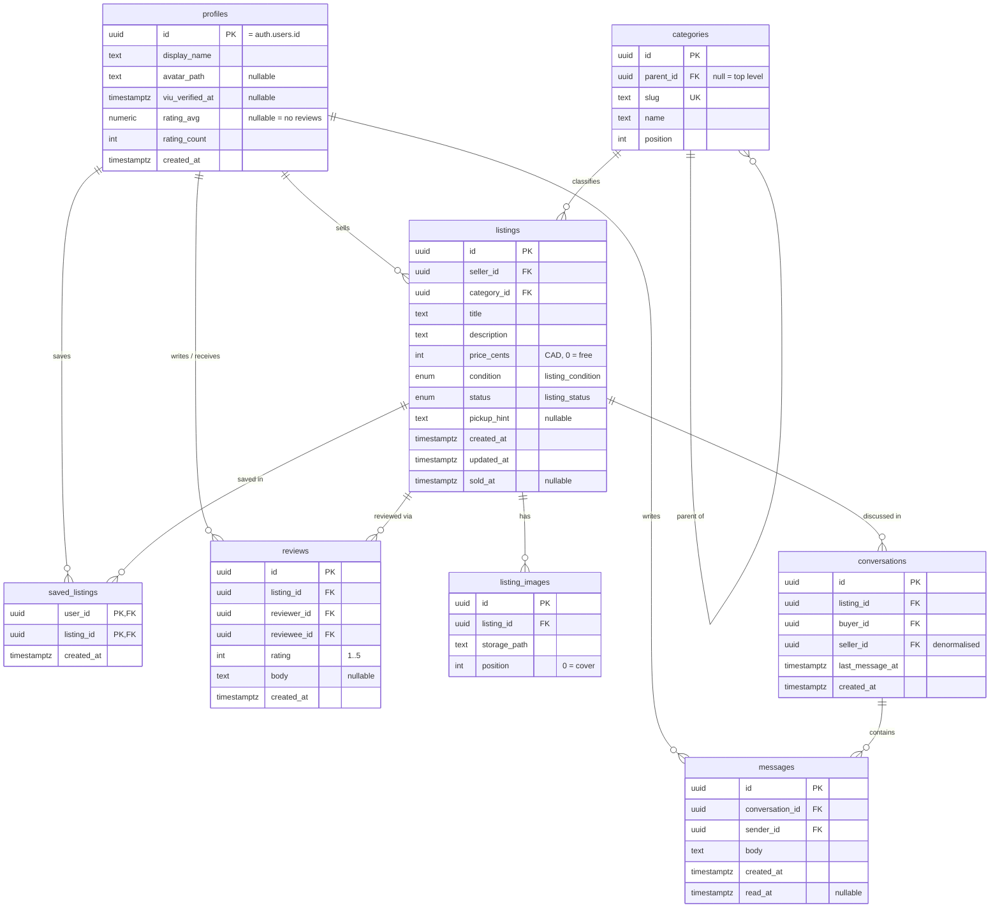

# Rabbithole schema

The v1 database. Eight tables, one view, six triggers, one RPC.

This document is the transcription source for `supabase/migrations/` — Phase 3 is
copying, not inventing. Companion to [`roadmap.md`](roadmap.md).

## Conventions inherited from the codebase

These are not negotiable per migration; they come from
`.claude/rules/technical-defaults.md` and `src/types/README.md`, and the whole point
is that the hand-written types and the database agree without a translation layer.

| Rule | Consequence in SQL |
| --- | --- |
| Data is `snake_case` | Column names go straight onto the wire and into a component. No aliasing. |
| Money is integer cents, CAD | `price_cents integer`, never `numeric`, never a formatted string. `0` means free. |
| Timestamps are ISO 8601 strings | `timestamptz`. PostgREST serialises it as a string; nothing parses to `Date` at the model boundary. |
| Nullable carries meaning | `rating_avg null` is "no reviews", not zero. `primary_image null` is a real listing. |
| Closed sets are unions | Native Postgres enums, so `supabase gen types` emits the union. |

---

## Entity relationships



---

## Enums

```sql
create type public.listing_condition as enum ('new', 'like_new', 'good', 'fair', 'poor');
create type public.listing_status    as enum ('draft', 'active', 'reserved', 'sold', 'removed');
```

Member order matters: it becomes the sort order if anything ever orders by the
column, and `condition` is deliberately best-to-worst.

`ALTER TYPE ... ADD VALUE` cannot be used in the same migration that then uses the
new value, so any future addition is a two-migration change. The v1/v2 compatibility
contract promises no new members, so this should never come up.

---

## `profiles`

The public identity. Readable by every signed-in user, because every feed card
joins a seller preview.

```sql
create table public.profiles (
  id            uuid primary key references auth.users (id) on delete cascade,
  display_name  text not null check (char_length(display_name) between 1 and 60),
  avatar_path   text,
  viu_verified_at timestamptz,
  rating_avg    numeric(2,1) check (rating_avg between 1.0 and 5.0),
  rating_count  integer not null default 0 check (rating_count >= 0),
  created_at    timestamptz not null default now()
);
```

- **No `email` column, on purpose.** It lives in `auth.users`. Exposing it here
  would turn a public table into a scraped mailing list — the reason is already
  written into `src/types/profile.ts`.
- **`viu_verified_at` is a timestamp, not a boolean.** VIU addresses die at
  graduation, so "how stale is this verification" is a question that will be asked.
  A boolean cannot answer it.
- **`rating_avg` is nullable and denormalised.** `null` means no reviews yet.
  Maintained by trigger, because sorting a feed on a correlated subquery needs an
  index nobody has.

---

## No student number — and why

Dropped on 2026-09-18, after being designed. **A verified `@my.viu.ca` address
already proves VIU membership**, which is the only thing the number was going to be
used for. Everything else it offered was theatre:

- It could not be **verified** against VIU's records without an integration nobody
  has, so it would have been a self-asserted claim rendered next to a real one.
- It was **PII with no upside** — it cannot live on `profiles` (publicly readable,
  every feed card joins a seller preview), so it needed a whole second table, its
  own RLS posture, and a standing rule that nothing may render it as verified.

That is a table, a policy, a constraint, a form field, and a permanent caveat, in
exchange for nothing the email does not already do.

**If it is ever genuinely needed** — say VIU offers a verification endpoint — it
comes back as its own table keyed to `auth.users`, owner-only SELECT and no UPDATE
policy, never as a column on `profiles`. That reasoning is the part worth keeping.

---

## `categories`

```sql
create table public.categories (
  id        uuid primary key default gen_random_uuid(),
  parent_id uuid references public.categories (id) on delete restrict,
  slug      text not null unique check (slug ~ '^[a-z0-9-]+$'),
  name      text not null,
  position  integer not null default 0,
  constraint categories_not_own_parent check (id is distinct from parent_id)
);
```

- **`slug` is the stable identifier.** Safe to hardcode in client code; `name` is
  not, because it is display copy and will be reworded.
- **`on delete restrict`**, not cascade — deleting "Textbooks" must not silently
  take five subject categories and every listing under them.
- **Two levels are enforced by trigger.** A CHECK constraint cannot run the subquery
  that asks whether the parent itself has a parent.
- **`position` orders the Discover category bar.** Without it the order is whatever
  the planner returns, which puts Course Supplies wherever it likes.

---

## `listings`

```sql
create table public.listings (
  id          uuid primary key default gen_random_uuid(),
  seller_id   uuid not null references public.profiles (id) on delete cascade,
  category_id uuid not null references public.categories (id) on delete restrict,
  title       text not null check (char_length(title) between 1 and 200),
  description text not null default '',
  price_cents integer not null check (price_cents >= 0),
  condition   public.listing_condition not null,
  status      public.listing_status not null default 'draft',
  pickup_hint text check (pickup_hint is null or char_length(pickup_hint) <= 200),
  created_at  timestamptz not null default now(),
  updated_at  timestamptz not null default now(),
  sold_at     timestamptz,
  constraint listings_sold_has_timestamp
    check (status <> 'sold' or sold_at is not null)
);
```

- **`title` allows 200 characters.** eBay caps at 80 and Facebook at 100, but the
  nursing-bundle fixture in `src/mocks` is ~151 characters and exists specifically
  to break naive layouts. A tighter cap would reject a fixture the mocks README
  forbids tidying. Cards truncate at two lines with `numberOfLines`.
- **`description` is `not null default ''`.** The draft fixture has an empty
  description; that is a real state, and an empty string models it better than
  `null` because the UI never has to branch.
- **`price_cents >= 0`, and `0` is legal.** Free items are a real and common case.
  Rendering `0` as "$0.00" instead of "Free" is a design-rule violation.
- **`sold_at` is constrained one-directionally.** Sold implies a timestamp; a
  timestamp does not imply sold, so a listing that goes `sold → removed` keeps its
  history rather than tripping a constraint.

---

## `listing_images`

```sql
create table public.listing_images (
  id           uuid primary key default gen_random_uuid(),
  listing_id   uuid not null references public.listings (id) on delete cascade,
  storage_path text not null,
  position     integer not null check (position >= 0),
  constraint listing_images_position_unique
    unique (listing_id, position) deferrable initially deferred
);
```

- **The uniqueness constraint is deferrable.** Reordering photos swaps two positions
  inside one transaction; a non-deferrable constraint fails halfway through the swap.
- **`storage_path` is an object path, not a URL.** Resolution to a URL is a
  `src/lib/storage.ts` helper. Paths start with the owner's uuid — see *Storage*.
- **Position 0 is the cover image.** A listing with no rows here is legitimate and
  common for cheap items; the UI renders a `surfaceSunken` placeholder rather than
  hiding the card.

---

## `saved_listings`

```sql
create table public.saved_listings (
  user_id    uuid not null references public.profiles (id) on delete cascade,
  listing_id uuid not null references public.listings (id) on delete cascade,
  created_at timestamptz not null default now(),
  primary key (user_id, listing_id)
);
```

The composite primary key makes saving idempotent — tapping the bookmark twice is
an upsert, not a duplicate. This table has no hand-written type in `src/types` yet;
Phase 3 adds `SavedListing`.

---

## `conversations`

```sql
create table public.conversations (
  id              uuid primary key default gen_random_uuid(),
  listing_id      uuid not null references public.listings (id) on delete cascade,
  buyer_id        uuid not null references public.profiles (id) on delete cascade,
  seller_id       uuid not null references public.profiles (id) on delete cascade,
  last_message_at timestamptz not null default now(),
  created_at      timestamptz not null default now(),
  constraint conversations_one_thread_per_buyer unique (listing_id, buyer_id),
  constraint conversations_not_self check (buyer_id <> seller_id)
);
```

- **`unique (listing_id, buyer_id)`** is what makes "Message seller" idempotent.
  Tapping it repeatedly reopens the same thread instead of spawning duplicates.
- **`seller_id` is denormalised from the listing** so the inbox does not join to
  `listings` just to find the other party.
- **A conversation is always about a listing.** There is no general DM surface,
  which keeps moderation tractable — the reasoning is already in
  `src/types/messaging.ts`.

---

## `messages`

```sql
create table public.messages (
  id              uuid primary key default gen_random_uuid(),
  conversation_id uuid not null references public.conversations (id) on delete cascade,
  sender_id       uuid not null references public.profiles (id) on delete cascade,
  body            text not null check (char_length(body) between 1 and 2000),
  created_at      timestamptz not null default now(),
  read_at         timestamptz
);
```

`read_at` is only meaningful to the non-sender. It is written through the
`mark_conversation_read` RPC rather than a client UPDATE — see *Functions*.

---

## `reviews`

```sql
create table public.reviews (
  id          uuid primary key default gen_random_uuid(),
  listing_id  uuid not null references public.listings (id) on delete cascade,
  reviewer_id uuid not null references public.profiles (id) on delete cascade,
  reviewee_id uuid not null references public.profiles (id) on delete cascade,
  rating      integer not null check (rating between 1 and 5),
  body        text check (body is null or char_length(body) <= 1000),
  created_at  timestamptz not null default now(),
  constraint reviews_one_per_reviewer_per_listing unique (listing_id, reviewer_id),
  constraint reviews_not_self check (reviewer_id <> reviewee_id)
);
```

- **Reviews hang off a listing, not a user pair.** Selling someone two textbooks
  yields two reviewable events rather than one overwritten opinion.
- **`rating` is `integer` with a CHECK, not an enum.** The types file explains why
  it is typed `number` rather than `1|2|3|4|5` in TypeScript: PostgREST returns a
  plain number, and a literal union would force a cast on every read.
- **Bidirectional by construction.** Buyer-rates-seller and seller-rates-buyer are
  the same table with the roles reversed. A no-show buyer is as real a problem on a
  campus as a bad seller.

---

## Indexes

```sql
create index listings_feed_idx        on public.listings (status, created_at desc);
create index listings_seller_idx      on public.listings (seller_id, created_at desc);
create index listings_category_idx    on public.listings (category_id) where status = 'active';
create index listing_images_order_idx on public.listing_images (listing_id, position);
create index saved_listings_user_idx  on public.saved_listings (user_id, created_at desc);
create index conversations_buyer_idx  on public.conversations (buyer_id, last_message_at desc);
create index conversations_seller_idx on public.conversations (seller_id, last_message_at desc);
create index messages_thread_idx      on public.messages (conversation_id, created_at);
create index reviews_reviewee_idx     on public.reviews (reviewee_id);

-- Search is a first-class affordance per design-rules.md, not a filter.
create index listings_search_idx on public.listings
  using gin (to_tsvector('english', title || ' ' || description));
```

The inbox needs both `conversations` indexes because the same user is a buyer in
some threads and a seller in others, and the inbox is one list.

---

## Triggers

Seven. All the ones that touch `auth` or write across a row boundary are
`security definer set search_path = ''` — the empty search path is the hardening
that prevents search-path hijacking inside the definer context, and it means every
identifier inside must be schema-qualified.

| Trigger | On | Does |
| --- | --- | --- |
| `handle_new_user` | `auth.users` insert | Re-checks the VIU domain, then creates the `profiles` row |
| `handle_email_confirmed` | `auth.users` update of `email_confirmed_at` | Stamps `profiles.viu_verified_at` |
| `refresh_profile_rating` | `reviews` insert/update/delete | Recomputes `rating_avg` and `rating_count` |
| `touch_conversation` | `messages` insert | Advances `conversations.last_message_at` |
| `touch_listing` | `listings` update | Sets `updated_at`, and `sold_at` on the transition into `sold` |
| `enforce_category_depth` | `categories` insert/update | Raises if a category would nest three levels deep |

### `handle_new_user` — the third layer of the VIU gate

```sql
create or replace function public.handle_new_user()
returns trigger
language plpgsql
security definer
set search_path = ''
as $$
declare
  -- display_name is cosmetic, so taking it from user-controlled metadata is fine.
  -- Nothing is authorised on it. Falls back to the email local part, which for
  -- VIU is already "Preferred.Lastname".
  claimed_name text := coalesce(
    nullif(trim(new.raw_user_meta_data ->> 'display_name'), ''),
    replace(split_part(new.email, '@', 1), '.', ' ')
  );
begin
  -- The Before User Created hook is dashboard configuration and can be switched
  -- off without a commit. This check lives in a migration, so it cannot.
  if new.email !~* '@my\.viu\.ca$' then
    raise exception 'Rabbithole accounts require a @my.viu.ca address'
      using errcode = 'check_violation';
  end if;

  insert into public.profiles (id, display_name)
  values (new.id, claimed_name);

  return new;
end;
$$;

create trigger on_auth_user_created
  after insert on auth.users
  for each row execute function public.handle_new_user();
```

### `refresh_profile_rating`

```sql
create or replace function public.refresh_profile_rating()
returns trigger
language plpgsql
security definer
set search_path = ''
as $$
declare
  target uuid := coalesce(new.reviewee_id, old.reviewee_id);
begin
  update public.profiles p
     set rating_avg   = agg.avg_rating,
         rating_count = agg.n
    from (
      select round(avg(r.rating)::numeric, 1) as avg_rating,
             count(*)::integer                as n
        from public.reviews r
       where r.reviewee_id = target
    ) agg
   where p.id = target;

  return null;
end;
$$;
```

When the last review is deleted, `avg()` returns `null` and `count()` returns `0` —
which lands exactly on the "New seller" semantic the UI already handles. That is the
behaviour, not an accident of it.

---

## Row-level security

Every table gets `enable row level security`. Every policy is scoped
`to authenticated` and wraps `auth.uid()` in a subselect.

**Why `(select auth.uid())` rather than bare `auth.uid()`:** the subselect lets
Postgres evaluate it once as an initPlan instead of re-running it per row. This is
still current Supabase guidance and it is the difference between a feed query that
scales and one that does not.

**Why `to authenticated` rather than leaving it open:** the policy is not evaluated
at all for anonymous requests, which is a cheaper rejection than filtering rows.

```sql
-- profiles: public identity, owner-writable. No INSERT policy — the signup
-- trigger is the only writer, and it is SECURITY DEFINER.
create policy "profiles readable by signed-in users"
  on public.profiles for select to authenticated using (true);

create policy "a user updates only their own profile"
  on public.profiles for update to authenticated
  using ((select auth.uid()) = id)
  with check ((select auth.uid()) = id);

-- listings: drafts and removed listings are owner-only.
create policy "live listings are visible; drafts are not"
  on public.listings for select to authenticated
  using (status in ('active', 'reserved', 'sold') or (select auth.uid()) = seller_id);

create policy "a seller writes their own listings"
  on public.listings for insert to authenticated
  with check ((select auth.uid()) = seller_id);

create policy "a seller edits their own listings"
  on public.listings for update to authenticated
  using ((select auth.uid()) = seller_id)
  with check ((select auth.uid()) = seller_id);

-- listing_images: visibility follows the parent listing. The subquery is itself
-- filtered by the listings policy above, so a draft's images are owner-only for
-- free — no duplicated status logic.
create policy "images follow their listing's visibility"
  on public.listing_images for select to authenticated
  using (exists (select 1 from public.listings l where l.id = listing_id));

create policy "a seller manages their own listing's images"
  on public.listing_images for all to authenticated
  using (exists (
    select 1 from public.listings l
     where l.id = listing_id and l.seller_id = (select auth.uid())
  ))
  with check (exists (
    select 1 from public.listings l
     where l.id = listing_id and l.seller_id = (select auth.uid())
  ));

-- saved_listings: entirely private to the saver.
create policy "a user manages only their own saves"
  on public.saved_listings for all to authenticated
  using ((select auth.uid()) = user_id)
  with check ((select auth.uid()) = user_id);

-- conversations: participants only. A buyer may open a thread on someone else's
-- live listing, and on nobody's draft.
create policy "participants read their conversations"
  on public.conversations for select to authenticated
  using ((select auth.uid()) in (buyer_id, seller_id));

create policy "a buyer opens a thread on a live listing"
  on public.conversations for insert to authenticated
  with check (
    (select auth.uid()) = buyer_id
    and exists (
      select 1 from public.listings l
       where l.id = conversations.listing_id
         and l.seller_id = conversations.seller_id
         and l.seller_id <> (select auth.uid())
         and l.status in ('active', 'reserved')
    )
  );

-- messages: readable and writable only inside a thread you are in. The
-- conversations policy does the participant check, so it is not repeated here.
-- No UPDATE policy — read_at goes through mark_conversation_read().
create policy "participants read their messages"
  on public.messages for select to authenticated
  using (exists (select 1 from public.conversations c where c.id = conversation_id));

create policy "a participant sends as themselves"
  on public.messages for insert to authenticated
  with check (
    (select auth.uid()) = sender_id
    and exists (select 1 from public.conversations c where c.id = conversation_id)
  );

-- reviews: public trust signal, writable only after a completed trade.
create policy "reviews readable by signed-in users"
  on public.reviews for select to authenticated using (true);

create policy "a participant reviews a sold listing"
  on public.reviews for insert to authenticated
  with check (
    (select auth.uid()) = reviewer_id
    and exists (
      select 1 from public.listings l
       where l.id = reviews.listing_id and l.status = 'sold'
    )
    and exists (
      select 1 from public.conversations c
       where c.listing_id = reviews.listing_id
         and (select auth.uid()) in (c.buyer_id, c.seller_id)
         and reviews.reviewee_id in (c.buyer_id, c.seller_id)
    )
  );

-- categories: read-only to clients. Seeded and administered, not user-generated.
create policy "categories readable by signed-in users"
  on public.categories for select to authenticated using (true);
```

**The review INSERT policy is the one worth re-reading.** Without the
"held a conversation on a sold listing" condition, reviews are free-form reputation
that anyone can write about anyone, which is the single cheapest way to make a
trust system worthless.

---

## The `listing_summaries` view

`src/types/README.md` calls `ListingSummary` "a forward declaration of a Postgres
view". This is that view.

```sql
create view public.listing_summaries with (security_invoker = on) as
select
  l.id, l.seller_id, l.category_id, l.title, l.description,
  l.price_cents, l.condition, l.status, l.pickup_hint,
  l.created_at, l.updated_at, l.sold_at,

  jsonb_build_object(
    'id',           p.id,
    'display_name', p.display_name,
    'avatar_path',  p.avatar_path,
    'rating_avg',   p.rating_avg,
    'rating_count', p.rating_count
  ) as seller,

  (
    select jsonb_build_object(
      'id', i.id, 'listing_id', i.listing_id,
      'storage_path', i.storage_path, 'position', i.position
    )
      from public.listing_images i
     where i.listing_id = l.id and i.position = 0
  ) as primary_image,

  (select count(*)::integer from public.listing_images i where i.listing_id = l.id)
    as image_count,

  exists (
    select 1 from public.saved_listings s
     where s.listing_id = l.id and s.user_id = (select auth.uid())
  ) as is_saved

from public.listings l
join public.profiles p on p.id = l.seller_id;
```

- **`security_invoker = on` is mandatory here.** Without it the view runs as its
  owner and bypasses the `listings` RLS policy entirely, which would publish every
  draft in the database. This is the single most dangerous line in the schema to get
  wrong.
- **`primary_image` is `null` when there is no position-0 row**, which is exactly
  what `ListingImage | null` means in the type.
- **`is_saved` resolves per viewer** via `auth.uid()`, so this column cannot be
  cached globally — the type already says so.

---

## Functions

### `mark_conversation_read`

Marking a thread read means updating `read_at` on messages the caller did *not*
send. That is an awkward RLS policy and a clean function.

```sql
create or replace function public.mark_conversation_read(p_conversation_id uuid)
returns integer
language plpgsql
security definer
set search_path = ''
as $$
declare
  affected integer;
begin
  -- SECURITY DEFINER bypasses RLS, so this membership check is not optional.
  -- It is the only thing standing between this function and a full-table update.
  if not exists (
    select 1 from public.conversations c
     where c.id = p_conversation_id
       and (select auth.uid()) in (c.buyer_id, c.seller_id)
  ) then
    raise exception 'Not a participant in this conversation'
      using errcode = 'insufficient_privilege';
  end if;

  update public.messages m
     set read_at = now()
   where m.conversation_id = p_conversation_id
     and m.sender_id <> (select auth.uid())
     and m.read_at is null;

  get diagnostics affected = row_count;
  return affected;
end;
$$;
```

Called as `supabase.rpc("mark_conversation_read", { p_conversation_id: id })`.

---

## Storage

Two public buckets. Object paths **start with the owner's uuid**, because the
standard Supabase policy matches `(storage.foldername(name))[1]` against it.

```
listing-images/{user_id}/{listing_id}/{position}.jpg
avatars/{user_id}/avatar.jpg
```

```sql
insert into storage.buckets (id, name, public)
values ('listing-images', 'listing-images', true),
       ('avatars',        'avatars',        true)
on conflict (id) do nothing;

create policy "listing images and avatars are publicly readable"
  on storage.objects for select
  using (bucket_id in ('listing-images', 'avatars'));

create policy "a user writes only into their own folder"
  on storage.objects for insert to authenticated
  with check (
    bucket_id in ('listing-images', 'avatars')
    and (storage.foldername(name))[1] = (select auth.uid())::text
  );

create policy "a user updates only their own objects"
  on storage.objects for update to authenticated
  using (
    bucket_id in ('listing-images', 'avatars')
    and (storage.foldername(name))[1] = (select auth.uid())::text
  );

create policy "a user deletes only their own objects"
  on storage.objects for delete to authenticated
  using (
    bucket_id in ('listing-images', 'avatars')
    and (storage.foldername(name))[1] = (select auth.uid())::text
  );
```

**Buckets are public-read on purpose.** Listing photos are advertisements; signed
URLs would add latency and expiry handling to every card in the feed for no privacy
gain. Write access is still owner-only.

`src/mocks/listings.ts` currently generates `listings/{listingId}/{position}.jpg`
with no user segment. That fixture is wrong about the schema rather than awkward on
purpose, so Phase 3 updates it.

---

## SQL ↔ TypeScript mapping

What `supabase gen types typescript` will emit, and what it must match.

| SQL | TypeScript | Note |
| --- | --- | --- |
| `uuid` | `string` | |
| `text` | `string` | |
| `text` nullable | `string \| null` | The null is meaningful; see the types README |
| `integer` | `number` | |
| `numeric(2,1)` | `number \| null` | PostgREST serialises numeric as a JSON number |
| `timestamptz` | `string` | ISO 8601. Never converted to `Date` at the boundary |
| `public.listing_status` | `"draft" \| "active" \| ...` | The reason for enums over `text` + CHECK |
| `jsonb_build_object(...)` in the view | the composed object | Typed by hand; generation cannot infer the shape |

Three additions to `src/types` land with Phase 3, all additive:
`Category.position`, `Listing.updated_at`, and a new `SavedListing` interface.
