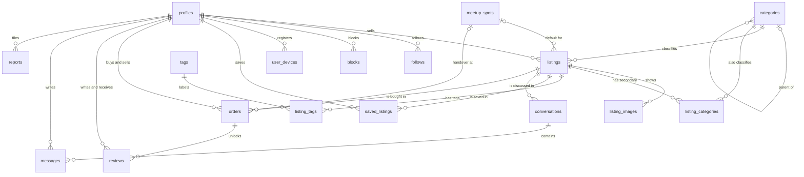
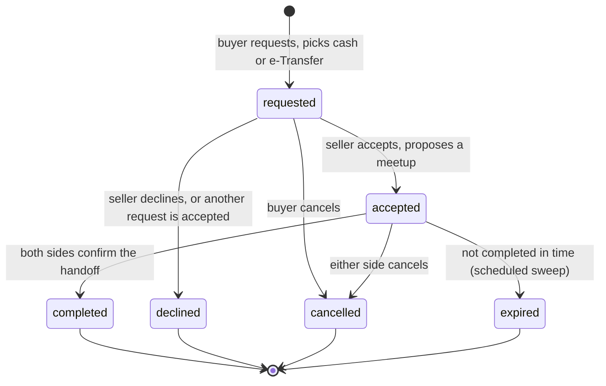

# Rabbithole schema

The v1 database. **Seventeen tables, three views, eight enums, sixteen triggers,
thirty-one RLS policies, forty-seven indexes.**

Rebuilt 2026-10-03 from the *VIU Marketplace — ER & Use Cases Overview (v1)*
requirements document, replacing the eight-table design of 2026-09-18.

**This document is no longer the transcription source.** It was, when the schema
was eight tables being copied into migrations for the first time. The migrations
are now the source of truth: they carry the column-level reasoning inline, and a
second copy of it here would be a second copy to forget to update. What lives
here instead is the map, the decisions, and the things no single migration file
can say.

Companion to [`roadmap.md`](roadmap.md) and [`auth-flow.md`](auth-flow.md).

## Conventions inherited from the codebase

These are not negotiable per migration; they come from
`.claude/rules/technical-defaults.md` and `src/types/README.md`, and the whole point
is that the hand-written types and the database agree without a translation layer.

| Rule | Consequence in SQL |
| --- | --- |
| Data is `snake_case` | Column names go straight onto the wire and into a component. No aliasing. |
| Money is integer cents, CAD | `price_cents integer`, never `numeric`, never a formatted string. `0` means free. |
| Timestamps are ISO 8601 strings | `timestamptz`. PostgREST serialises it as a string; nothing parses to `Date` at the model boundary. |
| Nullable carries meaning | `rating_avg null` is "no reviews", not zero. `primary_image null` is a real listing. |
| Closed sets are unions | Native Postgres enums, so `supabase gen types` emits the union. |
| Plural tables, `<role>_id` keys | `follows.follower_id`, `orders.buyer_id`. |

## Where everything is defined

| Migration | Holds |
| --- | --- |
| `20260918132138_enums_and_tables.sql` | 8 enums, 17 tables, every constraint |
| `20260918132144_indexes.sql` | 47 indexes, including two partial UNIQUE indexes that are correctness rather than speed |
| `20260918132150_triggers.sql` | 16 triggers and the functions behind them |
| `20260918132157_rls.sql` | RLS on all 16 public tables, 31 policies, and the **column grants** on `profiles` |
| `20260918132203_views.sql` | `public_profiles`, `my_profile`, `listing_summaries` |
| `20260918132209_storage.sql` | `listing-images` and `avatars` buckets + object policies |
| `20260918132214_auth_viu_gate.sql` | `before_user_created_viu_gate` — layer 2 of the VIU gate |
| `20261003090000_orders_and_functions.sql` | The order state machine and the other server-only writes |
| `20261003090100_reference_data.sql` | The 11 categories and 7 meetup spots. A migration, not a seed, because a hosted database needs them |
| `20261004090000_function_grants.sql` | Locks down function `EXECUTE`; moves the block check off a policy |

Development fixtures live in `supabase/seed.sql` and run on `db reset` only.
Negative authorization checks live in `supabase/checks/rls.sql`.

## Entity relationships

Relationships only. Columns are in the tables migration, where they sit beside
the reason they exist.


```mermaid
erDiagram
    profiles  ||--o{ listings       : sells
    profiles  ||--o{ follows        : follows
    profiles  ||--o{ blocks         : blocks
    profiles  ||--o{ user_devices   : registers
    profiles  ||--o{ saved_listings : saves
    profiles  ||--o{ orders         : "buys and sells"
    profiles  ||--o{ reviews        : "writes and receives"
    profiles  ||--o{ messages       : writes

    categories |o--o{ categories          : "parent of"
    categories ||--o{ listings            : classifies
    categories ||--o{ listing_categories  : "also classifies"
    tags       ||--o{ listing_tags        : labels

    listings ||--o{ listing_images     : shows
    listings ||--o{ listing_categories : "has secondary"
    listings ||--o{ listing_tags       : "has tags"
    listings ||--o{ saved_listings     : "is saved in"
    listings ||--o{ conversations      : "is discussed in"
    listings ||--o{ orders             : "is bought in"

    meetup_spots |o--o{ listings : "default for"
    meetup_spots |o--o{ orders   : "handover at"

    orders        ||--o{ reviews  : unlocks
    conversations ||--o{ messages : contains

    profiles ||--o{ reports : files
```

`private.reports` is omitted above on purpose — it points at profiles, listings
and messages, but it is not in the API's exposed schemas and no client can reach
it at all.

## The three data tiers

The single most important thing in this schema, and the one a reader is most
likely to get wrong.

| Tier | Who can read | Where |
| --- | --- | --- |
| **Public** | any signed-in user | username, bio, campus, avatar, ratings, completed sales, response time, last active *if shown*, reviews, live listings |
| **Owner-only** | the user and the server | saved listings, follows, orders, conversations, notification preferences |
| **Server-only** | Edge Functions and the service role | VIU email (`auth.users`), push tokens, reports and reporter identity |

**RLS cannot express the first two on `profiles`, because RLS is row-level.**
One `profiles` row carries public trust signals, owner-only preferences, and
server-written counters side by side. Column grants do that separation, so
`20260918132157_rls.sql` revokes the table grant and re-grants specific columns:

- `select *` on `profiles` is **denied outright**. Clients read `public_profiles`
  or `my_profile`.
- `rating_sum`, `rating_count`, `completed_sales`, `response_rate`,
  `median_response_minutes`, `status` and `viu_verified_at` are not grantable for
  update. Without that, a seller raises their own rating with one `PATCH` and the
  trust system is decorative.

## Enums

| Enum | Members |
| --- | --- |
| `campus` | `nanaimo`, `cowichan`, `powell_river`, `parksville_qualicum` — **unverified against VIU's real locations** |
| `listing_condition` | `new`, `like_new`, `good`, `fair`, `poor` — best-to-worst, which becomes the sort order |
| `listing_status` | `draft`, `active`, `reserved`, `sold`, `removed`, `expired` |
| `order_status` | `requested`, `accepted`, `completed`, `declined`, `cancelled`, `expired` |
| `payment_method` | `cash`, `etransfer` |
| `account_status` | `active`, `suspended`, `banned`, `deleted` |
| `report_reason` | `prohibited_item`, `academic_dishonesty`, `scam_or_fraud`, `counterfeit`, `harassment`, `spam`, `other` — **proposed, not transcribed** |
| `report_status` | `open`, `reviewing`, `actioned`, `dismissed` |

## The order lifecycle

No money moves through the app. The order row is what makes a sale a fact rather
than a claim, and a **completed** order is the only thing that unlocks a review
or increments `completed_sales`.


```mermaid
stateDiagram-v2
  [*] --> requested : buyer requests, picks cash or e-Transfer
  requested --> accepted  : seller accepts, proposes a meetup
  requested --> declined  : seller declines, or another request is accepted
  requested --> cancelled : buyer cancels
  accepted  --> completed : both sides confirm the handoff
  accepted  --> cancelled : either side cancels
  accepted  --> expired   : not completed in time (scheduled sweep)
  completed --> [*]
  declined  --> [*]
  cancelled --> [*]
  expired   --> [*]
```

| Order status | Listing status | Side effects |
| --- | --- | --- |
| `requested` | `active` | Several requests can be pending at once |
| `accepted` | `reserved` | Every other pending request is auto-declined in the same transaction |
| `completed` | `sold`, `sold_at` set | `completed_sales` +1 for the seller; both sides may leave one review |
| `declined` / `cancelled` / `expired` | back to `active` | Nothing else changes |

**Every transition runs inside one server function.** A client doing this in four
`PATCH`es can be interrupted between any two of them, and the failure mode is an
item sold twice. `orders` has no INSERT, UPDATE or DELETE grant at all.

Two partial UNIQUE indexes make it safe under concurrency:
`orders_one_live_per_listing_idx` means at most one accepted-or-completed order
per listing even when two accepts race, and `orders_one_open_request_per_buyer_idx`
stops a buyer queuing forty requests on one item.

## Trust signals and who writes them

Every one is server-written. None is client-writable.

| Column | Maintained by | Note |
| --- | --- | --- |
| `rating_sum`, `rating_count` | `refresh_profile_rating` on review write | Sum and count, not an average, so adding a review is a two-integer increment that cannot drift |
| `rating_avg` | **generated column** over the two above | `null` when `rating_count = 0`. Renders "New seller", never "0.0 stars" |
| `completed_sales` | `confirm_handoff` on the second confirmation | |
| `response_rate`, `median_response_minutes` | `refresh_response_metrics` on a sender's first message in a thread | `null` means not enough conversations to say, which is not 0% |
| `viu_verified_at` | `handle_email_confirmed` | A timestamp, not a boolean: VIU addresses expire at graduation |

`refresh_response_metrics` fires on the **buyer's** first message as well as the
seller's. Without that, a seller who never replies is never recalculated and
keeps a `null` rate forever — the one behaviour the metric exists to expose.

## Row-level security posture

Every table has RLS enabled and default-deny. Conventions applied without
exception:

- `(select auth.uid())`, never bare `auth.uid()` — the subselect is evaluated
  once as an initPlan rather than per row.
- `to authenticated` on every policy, so nothing is evaluated at all for
  anonymous requests.
- Every policy that creates user-visible content also calls
  `is_account_active()`. That is what makes `suspended` actually suspend
  somebody rather than merely label them.

**Block and closed-thread checks live in `SECURITY DEFINER` triggers, not in
policies.** A policy expression is evaluated as the calling user, so a policy
that calls a definer function requires that user to hold `EXECUTE` on it — and
PostgREST publishes any non-trigger function as an RPC endpoint. That combination
briefly turned `is_blocked_between()` into an oracle any signed-in user could ask
"did X block Y", defeating the blocks policy outright. See
`20261004090000_function_grants.sql`; `supabase/checks/rls.sql` §19–20 guards it.

## Views

| View | Security | Why |
| --- | --- | --- |
| `public_profiles` | **definer** | The only path to `last_active_at`, which column grants deny directly, and it applies the `show_last_active` rule on the way through |
| `my_profile` | **definer** | Returns the caller's own row including preferences. Its `where id = auth.uid()` *is* the authorization |
| `listing_summaries` | **`security_invoker = on`** | Load-bearing. Without it the view runs as its owner, bypasses the listings policy, and publishes every draft in the database |

## Client-callable functions

Twelve, and no more — `20261004090000` revoked the default `PUBLIC` grant from
everything else.

`request_order` · `accept_order` · `decline_order` · `confirm_meetup` ·
`confirm_handoff` · `cancel_order` · `renew_listing` · `mark_conversation_read` ·
`submit_report` · `register_device` · `delete_my_account` · `is_account_active`

`expire_stale_orders` and `expire_stale_listings` are **service-role only** —
they ignore `auth.uid()` and operate on every qualifying row.

## Storage

Two public buckets, `listing-images` and `avatars`. Public read is deliberate:
listing photos are advertisements, and signed URLs would add an expiry to manage
and a round trip per card. Writes are strictly owner-only, enforced by matching
`(storage.foldername(name))[1]` against `auth.uid()` — so the owner's uuid **must**
be the first path segment, or write authorization silently breaks.

```
listing-images/{user_id}/{listing_id}/{position}.jpg
avatars/{user_id}/avatar.jpg
```

## SQL ↔ TypeScript mapping

What `supabase gen types typescript` emits, and what it must match.

| SQL | TypeScript | Note |
| --- | --- | --- |
| `uuid`, `text`, `citext` | `string` | |
| `text` nullable | `string \| null` | The null is meaningful; see the types README |
| `integer`, `smallint` | `number` | |
| `numeric(2,1)` | `number \| null` | PostgREST serialises numeric as a JSON number |
| `timestamptz` | `string` | ISO 8601. Never converted to `Date` at the boundary |
| `public.listing_status` | `"draft" \| "active" \| …` | The reason for enums over `text` + CHECK |
| `tsvector` | `unknown` | `search_vector` is generated and stored, so it **does** appear in generated types |
| `jsonb_build_object(…)` in a view | the composed object | Typed by hand; generation cannot infer the shape |

Views report no `NOT NULL` information, so every `listing_summaries` column
generates as `| null`. `toSummary()` in `src/lib/queries/listings.ts` carries that
cast **once**, rather than `!` scattered across every screen.

## Departures from the requirements doc

Three, each marked `DEPARTURE` in the SQL beside its reason.

1. **`draft` kept** in `listing_status`. The doc drops it; the Post Listing screen
   needs a pre-publish state and a policy is written against it.
2. **`sold_at` biconditional softened.** The doc's
   `(status = 'sold') = (sold_at is not null)` forces a seller removing a sold
   listing to erase `sold_at`, destroying the record a completed order points at.
   Two constraints give the same intent while letting history survive removal.
3. **`search_vector` is a stored generated column**, per the doc, reversing the
   earlier expression-index choice. It is faster and weightable; the cost is that
   it now appears in generated types.

Plus one addition: four `notify_*` booleans on `profiles`. Use case 44 ("manage
which notifications they receive") had nowhere to live — the ER diagram has no
preferences table and `user_devices` holds tokens, not choices.

## Known gaps

- **The campus list is unverified** against VIU's real locations, and so are the
  meetup spot names. Adding an enum member later is cheap; renaming one is not.
- **`report_reason` members are proposed**, drawn from `design-rules.md`'s
  prohibited list rather than from the requirements document.
- **Nobody reads the moderation queue.** `private.reports` is service-role only.
  `design-rules.md` says a Report button leading nowhere is worse than none, so
  that button should not ship until a person is named.
- **The requirements doc says `@viu.ca` or `@my.viu.ca`.** The gate allows
  `@my.viu.ca` only, per the decision log in `roadmap.md`. The doc is the thing
  that should change.
